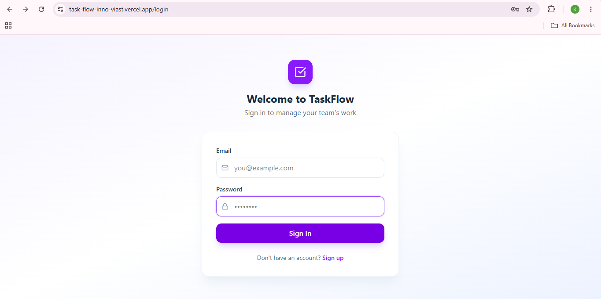
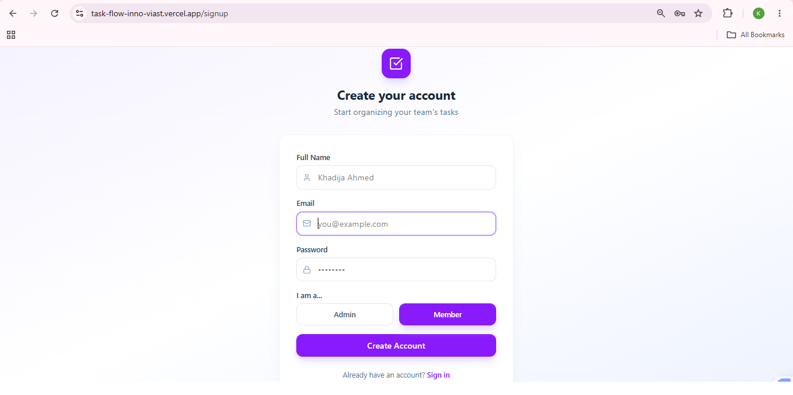
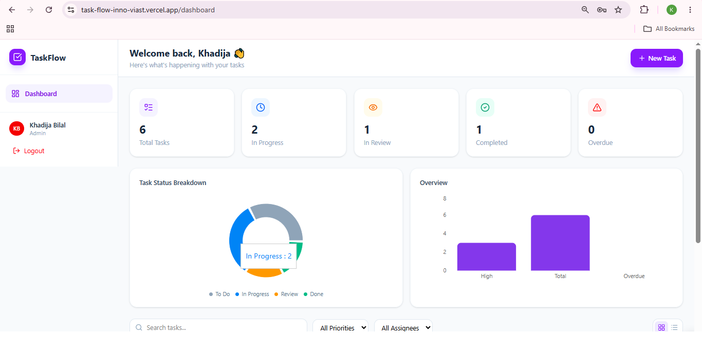
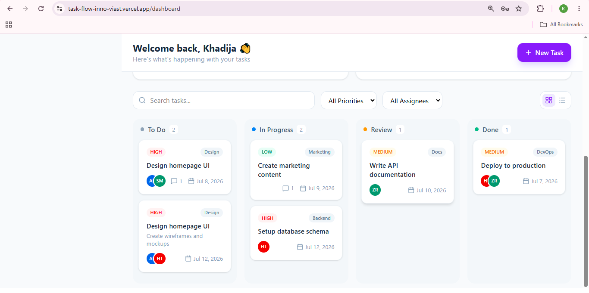
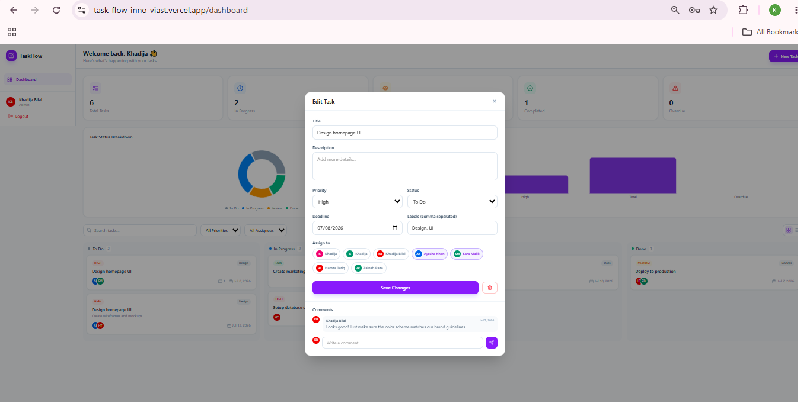
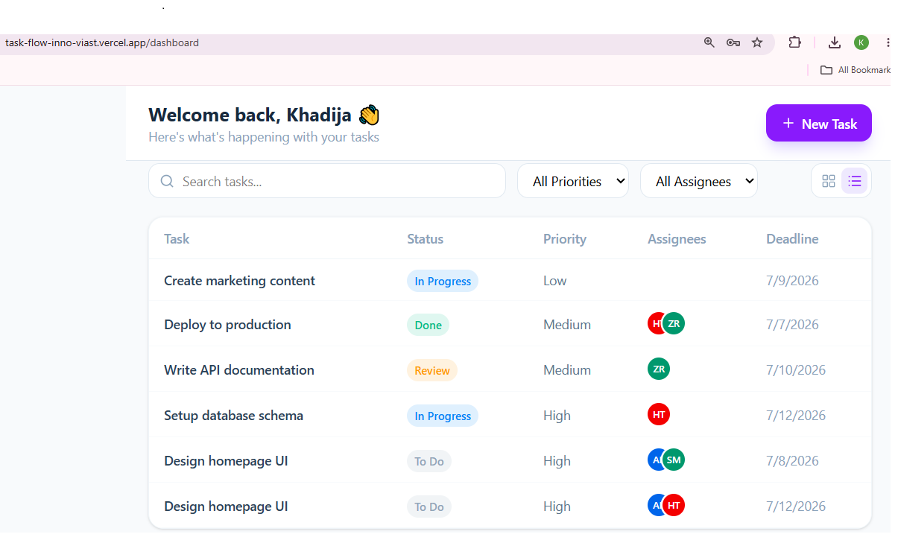
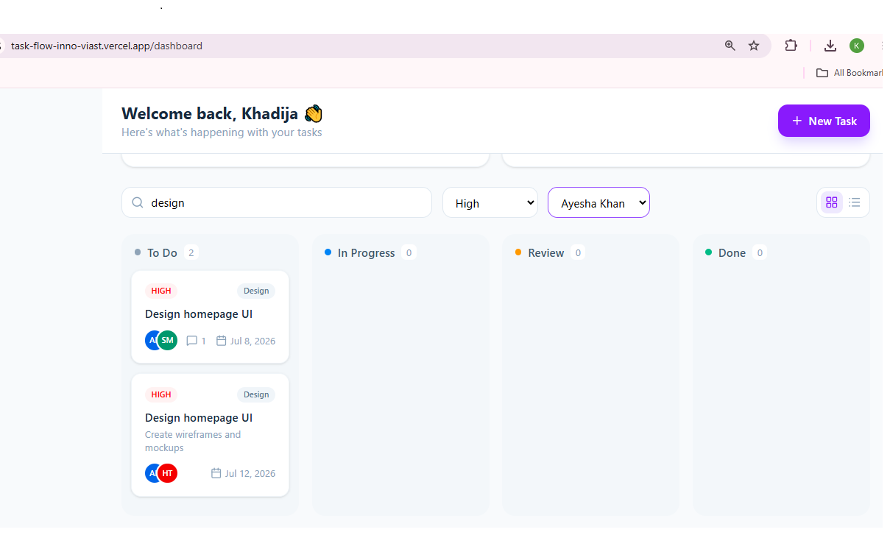
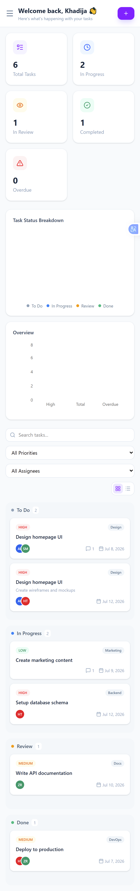
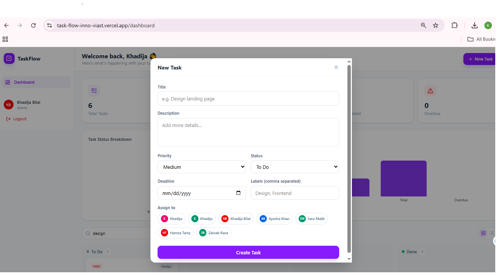

# TaskFlow-InnoViast

A full-stack collaborative task management and workflow platform built as part of the InnoViast Internship Program — Week 2, Track 02 (Full-Stack Product Engineering).

## 📌 Problem Statement

Teams often struggle to track daily tasks, deadlines, and responsibilities in one place. TaskFlow solves this by providing a visual, drag-and-drop Kanban board combined with a data-driven dashboard, so users can understand task status at a glance and manage work without confusion.

## ✨ Features

- **Authentication** — Secure signup/login with JWT and bcrypt password hashing
- **Role-based access** — Admin and Member roles with different permissions
- **Kanban Board** — Drag-and-drop tasks across To Do, In Progress, Review, and Done columns
- **List View** — Alternative tabular view of all tasks
- **Task Management** — Full CRUD with title, description, priority, deadline, and labels
- **Comments** — Threaded comments on each task for team communication
- **Assignment** — Assign tasks to one or more team members
- **Filters & Search** — Filter by priority, assignee, and search by title
- **Dashboard Analytics** — Real-time stat cards and charts (status breakdown, overdue tasks)
- **Responsive Design** — Fully usable on mobile, tablet, and desktop

## 🛠 Tech Stack

**Frontend:** React, Vite, Tailwind CSS, React Router, Recharts, @hello-pangea/dnd, Lucide Icons, Axios

**Backend:** Node.js, Express.js

**Database:** MongoDB Atlas (Mongoose ODM)

**Authentication:** JWT (JSON Web Tokens), bcryptjs

## 🚀 Getting Started (Local Setup)

### Prerequisites
- Node.js installed
- MongoDB Atlas account (or local MongoDB)

### Backend Setup
\`\`\`bash
cd backend
npm install
\`\`\`

Create a `.env` file in the `backend` folder:
\`\`\`
PORT=5050
MONGO_URI=your_mongodb_connection_string
JWT_SECRET=your_secret_key
CLIENT_URL=http://localhost:5173
\`\`\`

Run the backend:
\`\`\`bash
npm run dev
\`\`\`

### Frontend Setup
\`\`\`bash
cd frontend
npm install
npm run dev
\`\`\`

Visit `http://localhost:5173` in your browser.

## 📸 Screenshots

### Login Page

### Signup Page

### Dashboard Overview (Stats + Charts)

### Kanban Board

### Task Details Modal

### Task Comments

### List View

### Filters & Search

### Mobile Responsive View

### New Task Form

## 🌐 Live Deployment

- **Frontend:** https://task-flow-inno-viast.vercel.app
- **Backend API:** https://taskflow-innoviast.onrender.com

## 🎓 Learning Outcomes

- Implemented secure authentication using JWT and password hashing
- Designed a normalized MongoDB schema with embedded sub-documents (comments)
- Built role-based access control on both backend and frontend
- Implemented drag-and-drop interactions using @hello-pangea/dnd
- Created a responsive, production-quality UI with Tailwind CSS
- Practiced full-stack integration between React and Express REST APIs
- Used React Context API for global authentication state management

## 👩‍💻 Author

Khadija — InnoViast Internship, Track 02 (Full-Stack Product Engineering)